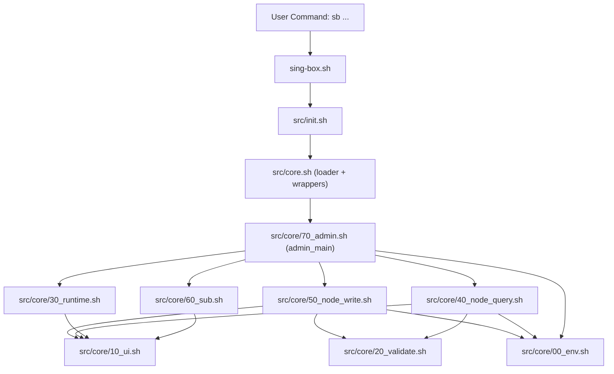

# 🚀 Sing-box-EV 魔改管理面板

一款专为 Linux 服务器设计的 **Sing-box** 一键安装与极简管理脚本。基于 233boy 优秀的原版逻辑进行深度重构，专为追求**极致防封锁、可视化极简操作、以及多节点便捷管理**的用户打造。

无论是刚接触 VPS 的小白，还是需要极客级内网穿透的高级玩家，本脚本都能让你在 3 分钟内搭建出最强健的科学上网节点！

---

## ✨ 核心杀手锏功能

- 🖥️ **现代化 TUI 交互面板**：告别繁琐的命令行输入，数字菜单一键直达。**全局支持输入 `0` 安全退出或返回上一级**，防误触体验极佳。
- 🔗 **全生态顶级协议支持**：内置 20+ 种协议。除了基础的 Shadowsocks、Trojan、Hysteria2 外，完美支持最前沿的 **VLESS-REALITY**。
- 📦 **双轨制“一键节点订阅 (Sub)”**：节点太多不好导入？面板一键生成 Base64 订阅代码，或瞬间开启临时 Web 服务（`http://IP:9866/sub.txt`），手机端点击“更新订阅”即可全自动同步所有节点。
- 🛡️ **两大抗封锁/穿透利器**：
  - **AnyTLS**：无缝伪装成海外大厂（如苹果、亚马逊）的正常流量，专治 SNI 阻断与深度包检测 (DPI)。
  - **CFtunnel (内网穿透)**：**没有公网 IP？服务器被墙了？** 直接通过 Cloudflare 边缘隧道拉出安全节点，无需开放任何 VPS 端口！
- 🔐 **隐私脱敏备注**：创建节点时可自定义备注（如“香港落地”）。生成的 URL 链接中，备注部分彻底移除真实的 IP 信息，安全分享无压力。
- 🤖 **全自动智能运维**：全自动识别放行 `UFW/Firewalld/Iptables` 防火墙；内置 Cron 守护任务，实现每周自动更新核心、每天自动清理日志，释放硬盘空间。

---

## ⚡ 快速安装与更新

**系统要求：** Ubuntu 20.04+ / Debian 11+ / CentOS 7+ (支持 x86_64 与 ARM64 架构)
**前提条件：** 必须使用 `root` 用户登录服务器执行。

运行以下一键安装命令：

```bash
bash <(curl -s -L https://raw.githubusercontent.com/LuoPoJunZi/sing-box-ev/main/install.sh)
```

备用链接安装命令：
```bash
bash <(curl -s -L https://github.com/LuoPoJunZi/sing-box-ev/raw/main/install.sh)
```
*(💡 提示：安装过程中会引导你自动创建一个默认的 VLESS-REALITY 节点，全程无需操作即可完成。)*

---

## 📖 新手快速上手指南

安装完成后，你在终端只需记住一个极其简单的短命令：

```bash
sb
```
*(或者输入完整命令 `sing-box` 并回车，即可随时唤出管理主面板。)*

### 1. 如何添加一个新节点？
1. 输入 `sb` 打开面板，输入 `1` 选择 **[添加配置]**。
2. 按照分类选择你需要的协议（新手强烈推荐选择 **18. VLESS-REALITY** 或 **20. AnyTLS**，极其抗封锁）。
3. 按照提示一直按回车（脚本会自动为你分配空闲端口并放行防火墙）。
4. 给节点起个名字（自定义备注），按下回车，你的节点就建好了！屏幕上会直接打印出类似 `vless://...` 的链接。

### 2. 节点太多了，怎么快速导入手机？
进入面板，选择 **(5) 节点订阅 (Sub)**。
脚本会把你在服务器上建好的所有节点打包，你可以选择：
* **方案 A**：直接复制屏幕上的一大段 Base64 乱码，在手机客户端（如 V2rayN, v2rayNG, Clash Verge）选择“从剪贴板导入”。
* **方案 B**：按照屏幕提示打开临时 Web 服务，把 `http://你的IP:9866/sub.txt` 填入客户端的订阅设置中，点击“更新订阅”瞬间全部同步！导入完按回车，临时服务自动销毁，绝对安全。

---

## 🚀 进阶高阶玩法：Cloudflare Tunnel 内网穿透教程

如果你的 VPS 没有公网 IP、端口被封，或者你想极致隐藏服务器的真实 IP，请使用面板中的 **(21) CFtunnel** 协议。

<details>
<summary>👉 点击展开保姆级 CFtunnel 穿透教程</summary>

### 第一阶段：在 Cloudflare 获取 Tunnel Token (首次使用必看)
1. 登录 Cloudflare 主页，进入 **Zero Trust** 面板（首次进入需绑定支付方式开通 Free 免费版，绝对不会扣费） 。
2. 依次点击左侧菜单的 **网络 (Networks) -> Tunnels (隧道)** 。
3. 点击 **Add a tunnel**，选择 **"Cloudflared (推荐)"**，为隧道随便起个名字并保存 。
4. 环境选择 Debian/Ubuntu，在页面下方会生成一串包含 `sudo cloudflared...` 的安装代码 。
5. **提取 Token：** 仔细找到代码里那串 **以 `ey` 开头的超长乱码** 并复制，这就是极其重要的 Tunnel Token 。

### 第二阶段：在 VPS 上部署穿透节点
1. 终端输入 `sb`，选择 `1` 添加配置，协议选 `21` (CFtunnel) 。
2. 提示端口时直接回车自动分配（**请记下屏幕上提示的绿色 5 位数内部端口号，例如 61505**） 。
3. 粘贴刚才复制的 **Token** 并回车 。
4. **输入绑定的域名：** 填入你准备使用的 CF 托管域名（如 `node1.example.com`）并填写备注 。

### 第三阶段：配置公网映射 (最后一步)
1. 回到刚才的 Cloudflare 网页端，点击下一步进入 **路由隧道 (Route Tunnel)** 页面 。
2. **Public Hostnames (公共主机名)** 配置：
   * 子域名：`node1`
   * 域：选择 `example.com`
   * 路径 (Path)：**留空，什么都别填！**
3. **服务 (Service)** 配置：
   * 类型 (Type)：必须选择 **`HTTP`** 。
   * URL：填写 **`127.0.0.1:你的端口号`**（例如 `127.0.0.1:61505`） 。
4. 点击 **Save hostname** 保存 。

大功告成！现在你可以直接使用 `sb sub` 生成订阅，把节点导入客户端直接起飞了！
</details>

---

## 💻 命令行快捷指令 (CLI)

如果你是极客用户，不想每次都进入面板，可以直接使用以下快捷指令：

| 指令 | 作用说明 |
| --- | --- |
| `sb a <协议>` | 快捷添加指定协议的节点 (如 `sb a reality`) |
| `sb i <备注名>`| 查看指定节点的详细参数和二维码链接 |
| `sb c <备注名>`| 更改指定节点的参数 (端口、密码、域名等) |
| `sb d <备注名>`| 快捷删除指定节点 |
| `sb sub` | 快速唤出订阅生成工具 |
| `sb all` | 清屏并一键罗列所有节点链接 |
| `sb log` | 查看服务器实时运行日志 |
| `sb update` | 检查并更新核心或脚本到最新版本 |

---

## 🧩 重构后文件结构与工作流程

为了提升可维护性，项目已从“单一超大 `core.sh`”重构为“核心壳层 + 分模块实现”。

### 1. 文件结构（修改后）

#### 顶层入口与安装

| 文件 | 作用 |
| --- | --- |
| `install.sh` | 一键安装脚本，负责环境检查、依赖安装、下载核心与脚本、初始化服务。 |
| `sing-box.sh` | CLI 入口，负责把命令参数转发给核心 `main` 分发函数。 |
| `README.md` | 使用说明、架构说明、开发流程。 |
| `CONTRIBUTING.md` | 贡献规范、代码约定、提交流程。 |

#### 核心脚本层

| 文件 | 作用 |
| --- | --- |
| `src/init.sh` | 运行时环境初始化（路径、版本、状态检测），并加载核心逻辑。 |
| `src/core.sh` | 兼容壳层：统一加载模块并保留公共函数入口，确保旧命令行为不变。 |

#### 新增模块目录 `src/core/`

| 文件 | 作用 |
| --- | --- |
| `00_env.sh` | 协议列表、展示字段、默认值等共享常量。 |
| `10_ui.sh` | UI 与输出辅助（消息、列表、暂停、页脚）。 |
| `20_validate.sh` | 输入校验、端口占用检测等验证逻辑。 |
| `30_runtime.sh` | 服务启停、重启失败检测、Cron 维护任务。 |
| `40_node_query.sh` | 节点查询链路（读取配置、详情展示、URL/二维码、全量列表）。 |
| `50_node_write.sh` | 节点写入链路（新增、修改、删除、配置生成）。 |
| `60_sub.sh` | 订阅生成流程（Base64 输出与临时 Web 服务）。 |
| `70_admin.sh` | 菜单与命令分发（`main`、`update`、`uninstall` 等管理入口）。 |
| `README.md` | 模块分工说明。 |

#### 质量与自动化

| 文件 | 作用 |
| --- | --- |
| `.github/workflows/lint.yml` | CI 自动检查 `shellcheck + shfmt`。 |
| `scripts/lint.sh` | 本地执行与 CI 同等的 lint 检查。 |
| `scripts/smoke.sh` | 本地只读冒烟检查（`help/version/status`）。 |
| `.gitattributes` | 统一脚本与文档换行符为 LF，减少跨平台噪音。 |

### 2. 命令执行工作流程

以执行 `sb add reality` 为例，链路如下：

1. 用户在终端执行 `sb ...`。
2. `sing-box.sh` 接收参数并调用 `main "$@"`。
3. `src/init.sh` 完成环境初始化并加载 `src/core.sh`。
4. `src/core.sh` 将请求转发给 `admin_main`（`src/core/70_admin.sh`）。
5. `admin_main` 根据命令路由到对应模块：
   - 节点新增/修改/删除 → `50_node_write.sh`
   - 节点查询/展示 → `40_node_query.sh`
   - 服务管理/Cron → `30_runtime.sh`
   - 订阅生成 → `60_sub.sh`
6. 模块内部复用：
   - UI 输出函数（`10_ui.sh`）
   - 校验函数（`20_validate.sh`）
   - 常量定义（`00_env.sh`）



### 3. 配置与服务工作流程

1. 新增/修改节点时，脚本生成或更新 `conf/*.json` 配置。
2. 变更完成后按需触发 `manage restart`，重载 sing-box 服务。
3. 若启用 TLS/Caddy 相关能力，会联动 Caddy 配置与重启。
4. 若使用 CFtunnel，会额外创建或清理对应 systemd 服务。
5. `sb sub` 会扫描配置并输出统一订阅内容。

### 4. 开发与提交流程（推荐）

1. 修改代码（优先在对应模块文件内修改，保持单一职责）。
2. 本地检查：
   - `bash scripts/lint.sh`
   - `bash scripts/smoke.sh`
3. 提交前确认：
   - 命令行为未破坏（`sb help/version/status` 至少通过）
   - 模块边界未混乱（查询逻辑不写入、写入逻辑不做分发）
4. 发起 PR，附带“变更摘要 + 回归结果 + 风险点”。

### 5. 本次重构的直接收益

* 代码维护从“单文件高耦合”变为“按职责分层”，更容易定位问题。
* 新增协议或新命令时，影响范围更可控。
* CI 与本地脚本形成质量门禁，减少脚本回归风险。
* 文件遍历与删除逻辑已做安全增强，降低误操作风险。

---

## 🆘 常见问题与急救指南

### 1. 急救：我的脚本彻底搞崩了，如何物理卸载？
如果因为错误操作导致面板无法进入，或者你想彻底清理服务器环境，请直接复制以下这段命令到终端执行，它将**无情地把脚本、核心、日志和定时任务连根拔起**，还你一个纯净的系统：

```bash
# 1. 停止并禁用所有相关服务
systemctl stop sing-box caddy 2>/dev/null
systemctl disable sing-box caddy 2>/dev/null

# 2. 删除核心守护服务和穿透服务
rm -f /lib/systemd/system/sing-box.service
rm -f /lib/systemd/system/caddy.service
rm -f /lib/systemd/system/cftunnel-*.service
systemctl daemon-reload

# 3. 清理自动更新和日志清理的定时任务
crontab -l 2>/dev/null | grep -v -E "sing-box update|/var/log/sing-box" | crontab -

# 4. 删除所有核心文件、配置目录和日志 (包含 Caddy)
rm -rf /etc/sing-box /var/log/sing-box /usr/local/bin/sing-box /usr/local/bin/sb
rm -rf /etc/caddy /usr/local/bin/caddy

# 5. 清理环境变量中的快捷命令别名并使其生效
sed -i "/sing-box/d" /root/.bashrc
sed -i "/alias sb=/d" /root/.bashrc
source /root/.bashrc

echo -e "\n✅ 物理清理完成！系统已彻底恢复纯净状态。"
```
清理完毕后，重新执行一键安装命令即可满血复活 [cite: 2]。

### 2. 客户端连不上节点怎么办？
* **检查安全组**：脚本会自动放行 VPS 内部防火墙，但如果你使用的是阿里云、腾讯云、AWS、甲骨文等主流云服务商，**必须登录其网页控制台，手动开放对应节点的端口号**。
* **检查时间**：科学上网协议对时间非常敏感，请确保你的 VPS 系统时间与标准时间误差不超过 90 秒。


## 📜 鸣谢与开源协议

* 本项目基于 [233boy/sing-box](https://github.com/233boy/sing-box) 优秀的底层逻辑进行深度重构与二次开发。
* Sing-box 核心项目：[SagerNet/sing-box](https://github.com/SagerNet/sing-box)。
* 本脚本遵循 GNU GPL v3 开源协议。

---

## 🛠️ 开发与质量检查

如果你准备参与开发或提交 PR，请先阅读 [CONTRIBUTING.md](./CONTRIBUTING.md)。

项目 CI 已接入 Shell 脚本检查：

* `shellcheck`
* `shfmt -d -i 4 -ci -sr`

本地可执行同等检查：

* `bash scripts/lint.sh`
* `bash scripts/smoke.sh`

